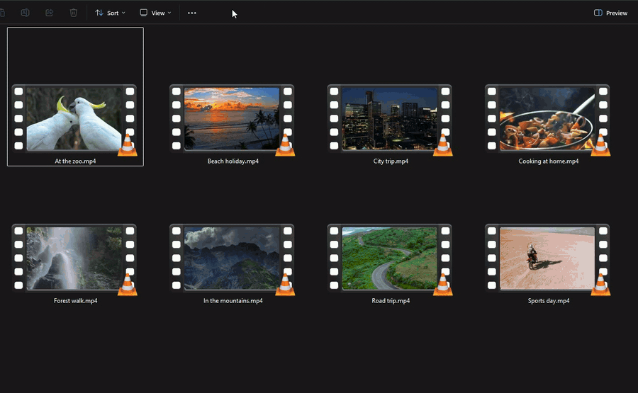
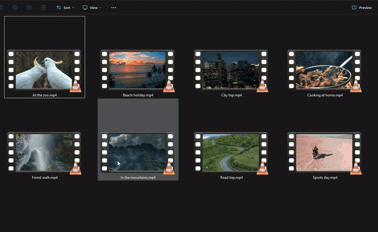
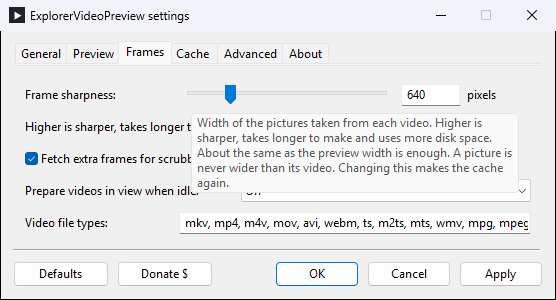
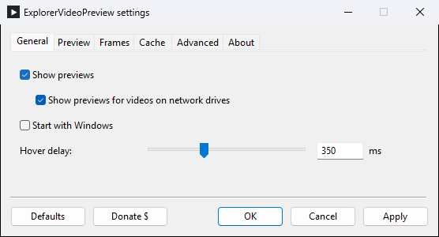
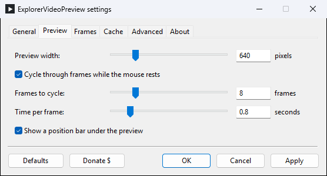
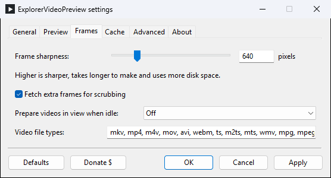
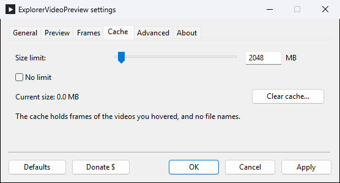
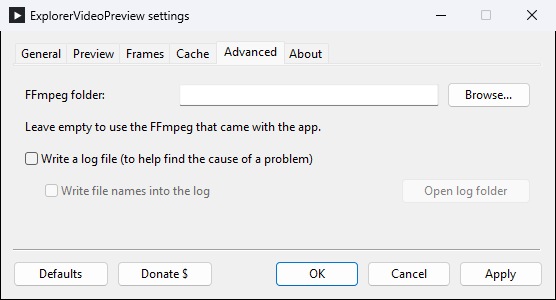
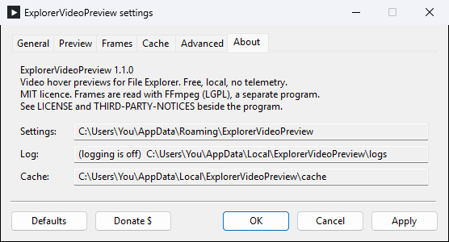

# ExplorerVideoPreview

**See inside your videos without opening them.** Hover a video in Windows File Explorer and a preview appears beside it. A free video hover preview for Windows 11: bigger than a thumbnail, and it moves through the whole video.

  

  <b>Free, with no ads and no limits.</b> If it saves you time, you can support it:

  

 

## See it in action

Hover a video and the preview steps through it by itself.

## How to get it

1. **Click the green Download button above.** One file is saved to your Downloads folder.
2. **Open that file.** Windows may show a blue box saying "Windows protected your PC". Click **More info**, then **Run anyway**. (Windows shows this for new apps it has not seen often yet.) Then click through the short setup.
3. **Hover any video in File Explorer.** That is all.

A small icon with a white triangle sits near the clock while the app is running. Right-click it for settings or to quit.

## Look through a whole video

Move the mouse sideways along a file: the left edge is the start of the video, the right edge is the end.

## What you can change

Preview size, sharpness, how many pictures it steps through and how fast, whether it shows previews on network drives, and whether it starts with Windows. Right-click the icon near the clock and choose **Settings**.

Not sure what a setting does? Rest the mouse on it and a short explanation appears.

Show the settings window

## Questions

**Is it free?**
Yes. No trial, no limits, no ads, no account.

**Does it send my files or anything else to the internet?**
No. Everything happens on your computer. The app does not connect to the internet at all.

**Which Windows do I need?**
Windows 11.

**Which videos does it work with?**
The usual ones: MP4, MKV, MOV, AVI, WMV, WebM and more. It also works on network drives.

**Can I keep it away from my network drives or NAS?**
Yes. Open Settings and, on the General tab, untick **Show previews for videos on network drives**. The app then never reads videos there. Videos on your own drives still get previews.

**Does it go through my whole video library?**
No. A video is only read when you hover it. The pictures it makes are kept on your computer so the next hover is instant; they take 2 GB at most unless you change the limit, and Settings has a button to clear them.

**How do I turn it off for a while?**
Right-click the icon near the clock and untick **Enabled**.

**How do I remove it?**
Open Windows Settings, go to Apps, then Installed apps, find ExplorerVideoPreview and choose Uninstall.

**Nothing happens when I hover a video.**
Look for the icon with the white triangle near the clock (it may be behind the small **^** arrow). If it is not there, start ExplorerVideoPreview from the Start menu. If it still does not work, open Settings from that icon, go to **Advanced**, tick **Write a log file**, try again, then click **Open log folder** and attach the newest file to a [report here](https://github.com/AleksaB98/ExplorerVideoPreview/issues).

**I would rather not use an installer.**
There is a [zip version](https://github.com/AleksaB98/ExplorerVideoPreview/releases/latest/download/ExplorerVideoPreview-Portable.zip): unzip it anywhere and start `evp.exe`.

## Support

ExplorerVideoPreview is free and stays free. It is made by one person in their spare time; if it is useful to you, a donation keeps it and my other free tools going.

  

---

Free to use under the MIT licence (see `LICENSE`). Video frames are read with FFmpeg, which is included; details in `THIRD-PARTY-NOTICES.md`. Demo clips from Mixkit.
